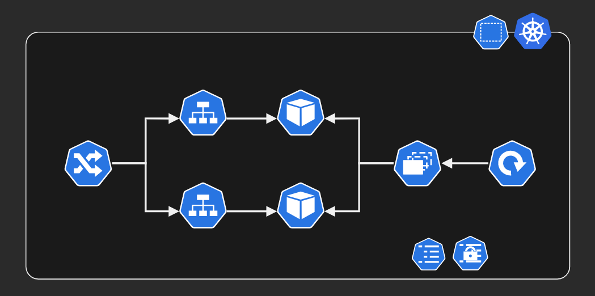

# Kubernetes ConfigMaps



### Minikube Deployment

Start minikube:

```sh
minikube start
```

Deploy

```sh
kubectl create configmap prod-app-config --from-env-file=config/prod-app.env
kubectl create secret generic inv-app-credentials --from-env-file=config/secrets.env

kubectl apply -f kubernetes.yaml
```

Start the tunnel:

```sh
minikube tunnel
```

Service should be available at:
```
curl http://localhost:30000/api/product/1
curl http://localhost:30100/api/inventory/1
```

### Local Development

```sh
dotnet dev-certs https --trust

dotnet restore
dotnet run

# Testing URLs
curl localhost:5017/api/product/1
curl localhost:5236/api/inventory/1
```

Local Docker operations:

```sh
# cd into the desired module
docker build -t 'image' .
docker run -d -p 5017:80 'image'
```


### Troubleshooting

```sh
kubectl exec --stdin --tty '<POD_NAME>' -- /bin/bash
```

### Sources

```
https://matthewpalmer.net/kubernetes-app-developer/articles/kubernetes-ports-targetport-nodeport-service.html
https://docs.microsoft.com/en-us/aspnet/core/fundamentals/environments?view=aspnetcore-6.0
https://docs.microsoft.com/en-us/aspnet/core/security/app-secrets?view=aspnetcore-6.0&tabs=windows
```